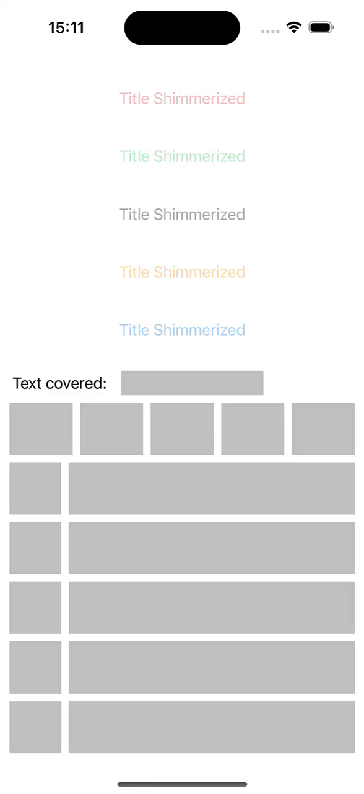

# ShimmerFX
Creates shimmer effects for SwiftUI Views



## Usage
```swift
import SwiftUI
import ShimmerFX

struct ShimmerizedView: View {
  var body: some View {
    Text("Text to shimmerize").shimmerize()
  }
}
```
## Parameters
- `active: Bool`: Determines whether the shimmering effect is active or not. (default value: true)
- `shouldAddHideMask: Bool`: Controls whether a mask (overlay) should be added to hide certain parts of the view. (default value: true)
- `hideMaskColor: Color`: Specifies the color of the mask. (default value: Color.gray)
- `hideMaskRadius: CGFloat`: Defines the corner radius of the mask. (default value: 0.0)
- `gradient: Gradient?`: Allows a custom gradient to be applied to the shimmering effect. If no gradient was provided it will use the default created by the library. (default value: nil)
- `animationDuration: TimeInterval`: Sets the duration of the shimmering animation cycle. (default value: 1.7)
- `animationDelay: TimeInterval`: Specifies the delay before the shimmering animation starts. (default value: 0.5)

## Installation
### Swift Package Manager
```ruby
.package(url: "https://github.com/leohsmedeiros/ShimmerFX.git", from: #version#)
```

### CocoaPods
```ruby
pod 'ShimmerFX', '~> v1.0'
```
